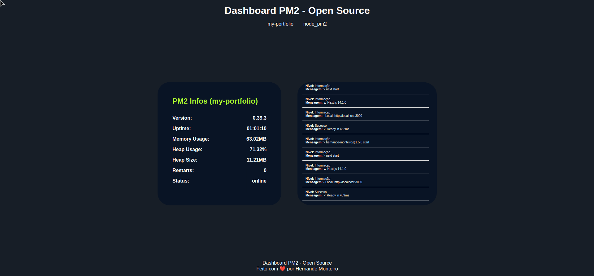

# node_pm2



**node_pm2** é um dashboard open-source para monitorar aplicações que utilizam o **PM2**. Ele é hospedado na própria máquina onde o projeto está rodando com PM2, permitindo uma fácil visualização e gerenciamento dos processos.

## Funcionalidades

- Exibe informações sobre os processos gerenciados pelo **PM2**
- Permite monitoramento dos processos
- Interface amigável para gerenciar aplicações diretamente no servidor
<!-- TODO: ADICIONAR FUNÇÕES DE REINICIAR O PROJETO ou PARAR -->

## Instalação

1. Clone o repositório:

   ```bash
   git clone https://github.com/hernandemonteiro/node_pm2.git
   cd node_pm2
   ```

2. Instale as dependências:

   ```bash
   npm install
   ```

3. Configure as variáveis de ambiente no arquivo `.env`. Exemplo:

   ```bash
   PASSWORD=suasenha
   PORT=3000  # Opcional, porta padrão será 3005 se não for especificada
   ```

4. Faça o build da aplicação:

   ```bash
   npm run build
   ```

## Uso

### Ambiente de Produção

Para iniciar o dashboard em ambiente de produção, rode:

```bash
npm start
```

### Ambiente de Desenvolvimento

Para desenvolvimento, utilize:

```bash
npm run dev
```

## Variáveis de Ambiente

- **PASSWORD** (Obrigatório): Define a senha para acessar o dashboard.
- **PORT** (Opcional): Define a porta em que o dashboard será servido. Se não especificado, a aplicação será hospedada na porta padrão `3005`.

## Contribuição

Contribuições são bem-vindas! Se você encontrar um problema ou tiver uma sugestão, por favor, abra uma issue ou faça um pull request.

---

Se precisar de ajustes ou mais detalhes, é só avisar!
